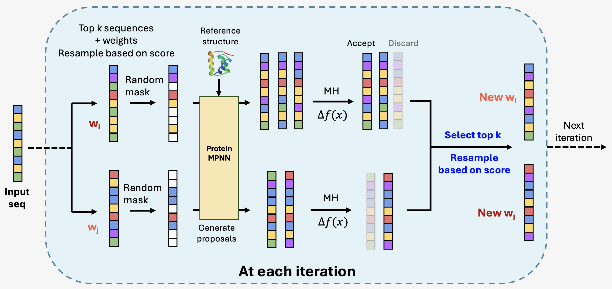
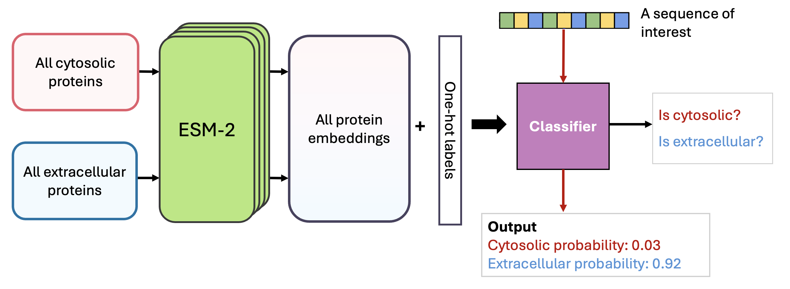

# ProVADA: Conditional Protein Variant Generation via Ensemble-Guided Test-Time Steering

[](https://opensource.org/licenses/MIT)
[](https://www.biorxiv.org/content/10.1101/2025.07.11.664238v1)

This repository contains the official implementation of **ProVADA** (**Pro**tein **V**ariant **Ada**ptation), a computational method for adapting existing proteins by designing novel variants
conditionally. Starting from a wild-type reference sequence, ProVADA steers the design process to optimize for desired functional properties, as described in our manuscript:

> **ProVADA: Generation of Subcellular Protein Variants via Ensemble-Guided Test-Time Steering**  
> Wenhui Sophia Lu*, Xiaowei Zhang*, Santiago L. Mille-Fragoso, Haoyu Dai, Xiaojing J. Gao, Wing Hung Wong.  
> *bioRxiv* (2025) [doi:10.1101/2025.07.11.664238](https://www.biorxiv.org/content/10.1101/2025.07.11.664238v1)

ProVADA leverages protein language models (ESM-2), structure-based models (ProteinMPNN), and a lightweight classifier to generate sequences optimized for a target property (e.g., subcellular location) while maintaining structural integrity and evolutionary plausibility.

## How ProVADA Works

At its core, ProVADA uses an iterative, population-based sampling algorithm called **MADA** (Mixture-Adaptation Directed Annealing) to explore the sequence space. At each iteration, promising sequences are selected through a down-sample-up-sampling process, partially masked, and then re-completed using ProteinMPNN to generate new proposals. These proposals are accepted or rejected based on a fitness score, guiding the population toward the desired properties.




<br> 

The fitness score combines multiple objectives. A key component is a lightweight property classifier, trained on ESM-2 embeddings, which predicts the probability of a sequence having the target function (e.g., cytosolic vs. extracellular localization). A regularization term penalizes for residue mismatch between the original wild-type sequence and the proposed variants.




## Installation

### 1. Prerequisites

Before installing, please ensure your system meets the following requirements:

*   **Python 3.11+**: This package requires Python version 3.11 or newer. You can verify your version by running:
    ```bash
    python3 --version
    ```
    Make sure that the `python3` command used to create the virtual environment in the next step points to a compatible version.

*   **ProteinMPNN**: This package relies on a local installation of ProteinMPNN for structure-based sequence design. Please follow the official [ProteinMPNN installation guide](https://github.com/dauparas/ProteinMPNN) to set it up first.

    **Crucially**, after installing ProteinMPNN, you must **update the `MPNN_SCRIPT` path in `provada/paths.py`** to point to your local `protein_mpnn_run.py` script.

### 2. Package Installation

We strongly recommend installing ProVADA in a clean, dedicated virtual environment.

The following commands will clone the repository, set up a virtual environment, and install the `provada` package with all its required Python libraries.

```bash
# 1. Clone this repository from GitHub
git clone https://github.com/SUwonglab/provada.git
cd provada

# 2. Create and activate a virtual environment using a compatible Python version
#    (The following commands create a 'venv' folder in your project directory)

# On macOS / Linux:
python3 -m venv venv
source venv/bin/activate

# On Windows:
# python -m venv venv
# venv\Scripts\activate

# 3. Install the provada package and its dependencies
#    This command reads the pyproject.toml file and installs everything needed.
pip install .
```


## Usage

### A Note on Using Your Own Proteins

The ProVADA workflow relies on two key utility scripts to prepare PDB structures for ProteinMPNN: `provada/utils/pdb_to_mpnn_jsonl.py` and `provada/utils/define_design_constraints.py`.

These scripts are designed to be general-purpose. However, due to the high variability in PDB file formatting (e.g., non-standard residue names, HETATMs, complex chain IDs), they **may need to be modified** to work correctly with your specific protein structures.


## Citation

If you use ProVADA in your research, please cite our manuscript:
```bibtex
@article {Lu2025.07.11.664238,
	author = {Lu, Wenhui Sophia and Zhang, Xiaowei and Mille-Fragoso, Luis S. and Dai, Haoyu and Gao, Xiaojing J. and Wong, Wing Hung},
	title = {ProVADA: Generation of Subcellular Protein Variants via Ensemble-Guided Test-Time Steering},
	elocation-id = {2025.07.11.664238},
	year = {2025},
	doi = {10.1101/2025.07.11.664238},
	publisher = {Cold Spring Harbor Laboratory},
	URL = {https://www.biorxiv.org/content/early/2025/07/17/2025.07.11.664238},
	eprint = {https://www.biorxiv.org/content/early/2025/07/17/2025.07.11.664238.full.pdf},
	journal = {bioRxiv}
}
