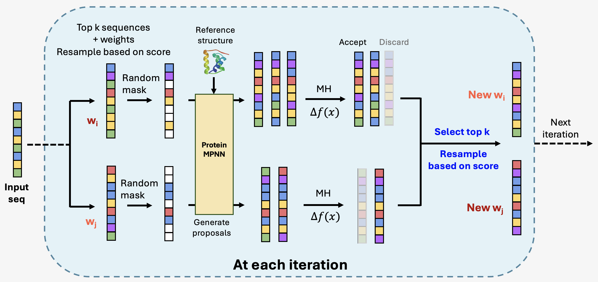

# ProVADA: Conditional Generation of Protein Variants via Ensemble-Guided Test-Time Steering 

[](https://github.com/SUwonglab/provada-dev/actions/workflows/unit_tests.yml)
[](https://github.com/SUwonglab/provada-dev/actions/workflows/flake8_check.yml)
[](https://opensource.org/licenses/MIT)
[](https://www.biorxiv.org/content/10.1101/2025.07.11.664238v1)


This repository contains the official implementation of **ProVADA** (**Pro**tein **V**ariant **Ada**ptation), a computational method for adapting existing proteins by designing novel variants
conditionally. Starting from a wild-type reference sequence, ProVADA steers the design process to optimize for desired functional properties.

### Publications & Presentations 📚
- [Pre-Print](https://www.biorxiv.org/content/10.1101/2025.07.11.664238v1)
- [Pacific Symposium on Biocomputing \[PSB\] 2026](https://psb.stanford.edu/)
    - [Manuscript](https://psb.stanford.edu/psb-online/proceedings/psb26/viggiano.pdf)
    - [Presentation Slides](https://docs.google.com/presentation/d/1yqo1EDRaBnx-Cc9LRNqsbd_hLHnK8asM7vcLFbOW1qE/edit?usp=sharing)
- Final Paper *(Coming Soon!)*


## What is ProVADA? 💡

At its core, ProVADA uses an iterative, population-based sampling algorithm called **MADA** (Mixture-Adaptation Directed Annealing) to explore the protein sequence space. At each iteration, promising sequences are selected through a down-sample-up-sampling process, partially masked, and then re-completed to generate new proposals. These proposals are accepted or rejected based on a fitness score, guiding the population toward the desired properties.



> An illustrated example of the MADA algorithm utilizing ProteinMPNN as a generator.


### Set up 🚧
We have created a start up script that installs all dependencies and sets up the conda environment `provada-env`. Please use the following commands to create and activate the environment:

```bash
bash create_env.sh
conda activate provada-env
```


## Example 🚀

We have provided a few example inputs in the `inputs` directory.

### Renin Localization: [inputs/renin](./inputs/renin/README.md)

### Nanobody Localization: [inputs/nanobodies](./inputs/nanobodies/README.md)

## Repository Structure 📂

```
provada-dev/
├── provada/                    # Main package source code
│   ├── components/            # Core components: Evaluators, Generators, Masking Strategies
│   │   ├── README.md          # Component system overview
│   │   ├── EVALUATORS.md      # Guide to creating custom scoring functions
│   │   ├── GENERATORS.md      # Guide to creating custom sequence generators
│   │   ├── MASKING.md         # Guide to creating custom masking strategies
│   │   ├── evaluator.py       # Evaluator base class and built-in evaluators
│   │   ├── generator.py       # Generator base class and built-in generators
│   │   └── masking.py         # Masking strategy base class and built-ins
│   ├── models/                # ML model wrappers (ESM3, ProteinMPNN, ESM2)
│   ├── sampler/               # Sampling algorithms (MADA, Rejection, etc.)
│   ├── sequences/             # Sequence processing and pairwise metrics
│   ├── utils/                 # Utilities (logging, multiprocessing, registry, etc.)
│   ├── base_variant.py        # Base variant class for starting protein
│   ├── paths.py               # Path configuration
│   └── README.md              # Package-level documentation
├── inputs/                    # Input files and configurations
│   └── renin/                 # Example: renin localization experiment
├── tests/                     # Test suite
├── results/                   # Output directory for experimental results
├── ProteinMPNN/               # Third-party ProteinMPNN integration
├── logs/                      # Application logs
├── wandb/                     # Weights & Biases experiment tracking
├── run_provada.py             # Main entry point for running experiments
├── run_multiple.py            # Run multiple experiments in parallel (multi-GPU)
└── conftest.py                # Pytest configuration
```

## Core Components 🧩

ProVADA's modular design is built around three extensible component types:

- **[Evaluators](provada/components/EVALUATORS.md)** - Score protein sequences based on desired properties (localization, stability, etc.)
- **[Generators](provada/components/GENERATORS.md)** - Generate new sequences by filling masked positions (ESM3, ProteinMPNN, etc.)
- **[Masking Strategies](provada/components/MASKING.md)** - Adaptively select which positions to redesign (DUCB, Thompson Sampling, etc.)

See the [Components README](provada/components/README.md) for detailed guides on creating custom components.

## Tests

To run tests to ensure all functionality works, use the following command:
```bash
pytest -sv
```


